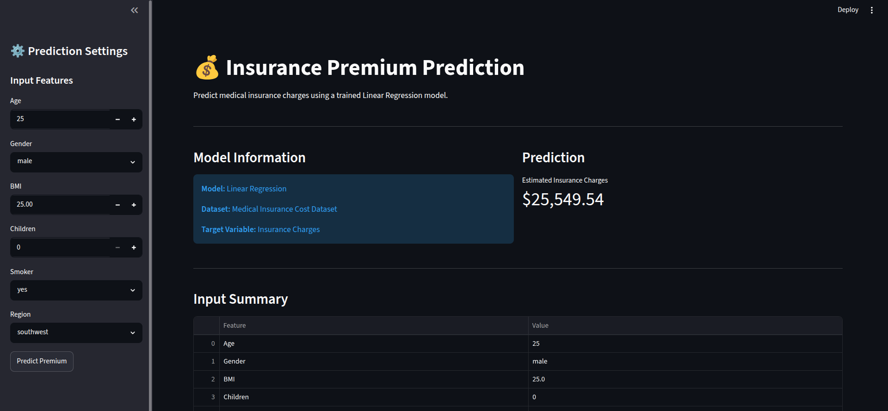

# Insurance Premium Prediction

<p align="center">
  
</p>

An end-to-end Machine Learning project that predicts medical insurance premiums using **Linear Regression**. The project covers the complete machine learning workflow, including data preprocessing, exploratory data analysis (EDA), model training, evaluation, and deployment through an interactive Streamlit web application.

## Live Demo

**Web Application:** https://rr-insurance-predictor.streamlit.app/

---

## Highlights

* End-to-end machine learning workflow from raw data to deployment
* Exploratory Data Analysis (EDA) with visual insights
* Feature preprocessing using **scikit-learn Pipeline** and **ColumnTransformer**
* Linear Regression model trained on real-world insurance data
* Interactive Streamlit application for real-time insurance premium prediction
* Model evaluation using **R2 Score**, **RMSE**, and **MAE**

## Workflow

1. Load dataset
2. Perform Exploratory Data Analysis (EDA)
3. Clean data (remove duplicate records)
4. Perform train-test split
5. Build preprocessing pipeline (`StandardScaler` + `OneHotEncoder`)
6. Train the Linear Regression model
7. Evaluate model performance
8. Save the trained pipeline using Joblib
9. Deploy the application using Streamlit

## Dataset

* **Source:** [Medical Insurance Cost Dataset](https://www.kaggle.com/datasets/mosapabdelghany/medical-insurance-cost-dataset) (Kaggle)
* **Original Records:** 1,338
* **Final Records After Cleaning:** 1,337 (1 duplicate removed)
* **Features:** Age, Sex, BMI, Children, Smoker, Region
* **Target:** Insurance Charges

## Model Performance

| Metric       | Score      |
| ------------ | ---------- |
| **R2 Score** | **0.796**  |
| **RMSE**     | **$5,940** |
| **MAE**      | **$4,069** |

## Tech Stack

| Category            | Technologies        |
| ------------------- | ------------------- |
| **Language**        | Python              |
| **Machine Learning**| scikit-learn        |
| **Data Processing** | pandas, NumPy       |
| **Visualization**   | Matplotlib, Seaborn |
| **Web Framework**   | Streamlit           |
| **Model Serialization** | Joblib          |

## Project Structure

```text
insurance-premium-prediction/
├── app/
│   └── app.py
├── data/
│   ├── raw/
│   │   └── insurance.csv
│   └── processed/
├── images/
│   └── app_preview.png
├── models/
│   └── linear_regression_pipeline.pkl
├── notebooks/
│   └── insurance_eda_model.ipynb
├── requirements.txt
├── .gitignore
└── README.md
```

## Quick Start

```bash
# Clone the repository
git clone https://github.com/Demon-diablo/insurance-premium-prediction

# Navigate to the project
cd insurance-premium-prediction

# Create a virtual environment
python3 -m venv .venv

# Activate the environment
source .venv/bin/activate

# Install dependencies
pip install -r requirements.txt

# Run the Streamlit application
streamlit run app/app.py
```

To retrain the model:

```bash
jupyter notebook notebooks/insurance_eda_model.ipynb
```

## Future Improvements

* Add Ridge, Lasso, and ElasticNet Regression models
* Build a model comparison dashboard
* Integrate SHAP for model explainability
* Hyperparameter tuning using GridSearchCV
* Deploy on additional cloud platforms (Hugging Face Spaces, Render)

## Acknowledgements

* **Dataset:** [Medical Insurance Cost Dataset](https://www.kaggle.com/datasets/mosapabdelghany/medical-insurance-cost-dataset) by **Mosap Abdelghany** (Kaggle)
